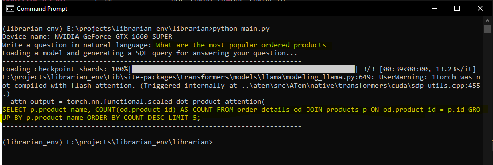
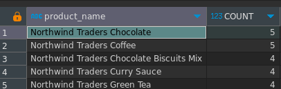
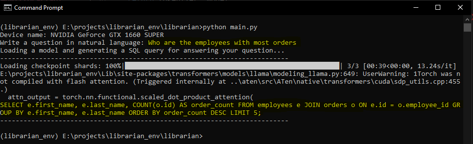
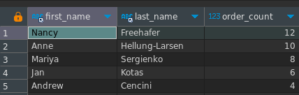
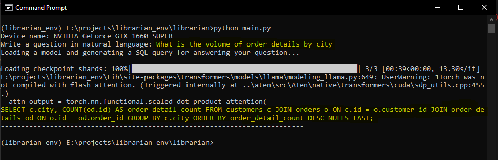
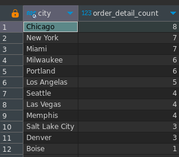

# Librarian :books:

This project is an experiment running different **text2sql** inference models against the [northwind database](https://github.com/dalers/mywind).

## System requirements:
- [Python3](https://www.python.org/downloads/)
- [CUDA Toolkit 11.8.0](https://developer.nvidia.com/cuda-toolkit-archive)
- [cuDNN 8.6](https://developer.nvidia.com/rdp/cudnn-archive)
- NVIDIA GPU with at least 6GB VRAM

```
pip install -r requirements.txt

pip install torch torchvision torchaudio --index-url https://download.pytorch.org/whl/cu118

pip install transformers

pip install accelerate

pip install bitsandbytes
```

Then simply run `python main.py` and type your natural language question.

## How does it work:

We are using the amazing [sqlcoder-7b-2 Pretrained Model](https://huggingface.co/defog/sqlcoder-7b-2) to perform our inference.

We proceed by grabbing a full mysql dump (`dump.sql`) of the available database and build a context `.sql` file employing some techniques such as:

- Reduce high cardinality categorical columns
- Only include columns that might actually be included in a query
- Lowercase categorical values
- Pinning specifically where the main relationships would occur in which fkey

In order to come up with `metadata3.sql` which once combined with `prompt.md` provides all the context available for the model to perform its inference.

A couple of techniques were also employed to make this large model work under 6GB of VRAM which is what I have available in my machine, namely:
 - Using `bitsandbytes` library and 4bit [quantization](https://huggingface.co/docs/optimum/en/concept_guides/quantization)
 - Reducing `max_new_tokens` to 250
 - Usage of `sdpa` for attention

Some tests with the other very cool model [Llama-2-7b-chat-finetune-for-text2sql](https://huggingface.co/ekshat/Llama-2-7b-chat-finetune-for-text2sql) are located under `old/playground.py` but upon testing it over and over and modifying the context data, this model had a tendency to hallucinate quite a lot! 

Bellow are some examples to showcase the power of text2sql.


## Examples:

> Q: What are the most popular ordered products? (EN)

> Q: Quais são os produtos mais vendidos em termos de quantidade? (PT-BR)



```
SELECT p.product_name, COUNT(od.product_id) AS COUNT FROM order_details od JOIN products p ON od.product_id = p.id GROUP BY p.product_name ORDER BY COUNT DESC LIMIT 5;
```

Running against test DB:



---

> Q: Who are the employees with most orders? (EN)

> Q: Quais os melhores vendedores? (PT-BR)



```
SELECT e.first_name, e.last_name, COUNT(o.id) AS order_count FROM employees e JOIN orders o ON e.id = o.employee_id GROUP BY e.first_name, e.last_name ORDER BY order_count DESC LIMIT 5;
```

Running against test DB:



---

> Q: What is the volume of order_details by city? (EN)

> Q: Qual é o volume de vendas por cidade? (PT-BR)



```
SELECT c.city, COUNT(od.id) AS order_detail_count FROM customers c JOIN orders o ON c.id = o.customer_id JOIN order_details od ON o.id = od.order_id GROUP BY c.city ORDER BY order_detail_count DESC NULLS LAST;
```

Running against test DB without NULLS LAST:

